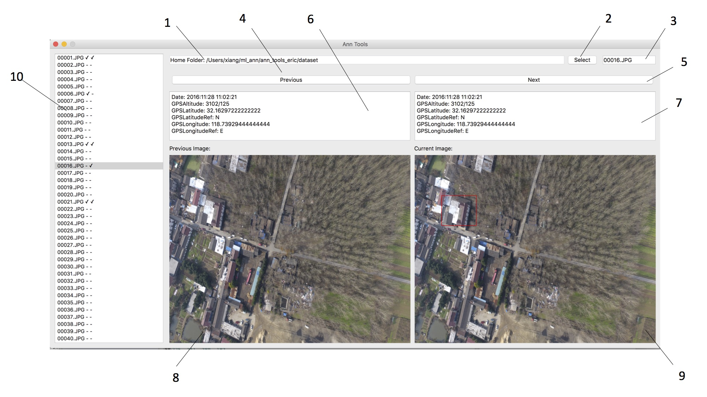

# 异常建筑标注工具

> Beta版，2017年6月6日更新​

​       

​        本软件是基于航拍图像和图像exif信息对潜在违章建筑进行半自动人工标注，生成异常建筑检测的数据库。该软件能够对上一日期与当前日期的图像进行比对标注，满足交叉对比的需求。


本软件下载地址：

```
https://github.com/simonchanper/ml_ann
```


- ##### 使用先决条件：

1. 选择任意一个文件夹作为根目录
2. 里面新建两个文件夹分别是prev和curr，对应上一个日期图像集和当前一个日期图像集
3. prev和curr图像对中，文件的命名必须完全一致，两个文件夹的图像文件数量必须一致
4. 图像中包含exif信息（GPS）
5. 所有图像分辨率需将宽度缩放到2000像素或以下1664像素以上，高度则保持比例缩放。 

- ##### 功能详解：

​       本软件是基于qt图形界面设计，具有自动读取图片中exif信息并把GPS坐标自动转换为地球经纬度；使用Bounding Box可以对图像中需要的建筑物进行标注，所有信息会全自动保存到对应的xml文件当中。



如上图：

1. 数据集根目录的位置，当选择了数据集的根目录后会现实。
2. 打开选择数据集根目录。
3. 对应图像对的文件名，可以选择任意在数据集中的文件名进行跳转。
4. 前一个图像，如果是首图像，则会跳到数据集中最后一张。
5. 下一个图像，如果是最后一张图像，则会跳到首图像。
6. 前一个日期图像exif信息。
7. 当前一个日期图像exif信息。
8. 前一个日期图像，使用绿色bounding box对目标进行标注，左键拉出四边形进行标注，右键会清除全部标注。
9. 当前一个提起图像，使用红色bounding box对目标进行标注，左键拉出四边形进行标注，右键会清除全部标注。

所有信息会通过xml进行记录，再次打开的时候会直接在软件中显示出来。


==P.S. 软件打开读取了图像数据集后，请分别在两个图像中单击鼠标对齐坐标。==


- ##### 安装教程

1. 安装python3，推荐安装[anaconda](https://www.continuum.io/downloads)包
2. 安装[pyqt5](https://pypi.python.org/pypi/PyQt5/5.8.2)
3. 安装[untangle](https://github.com/stchris/untangle)
4. 安装[ExifRead](https://pypi.python.org/pypi/ExifRead)

在终端中执行: 

```
python anntools.py
```


- ##### 收集与整理数据

  数据标注后，会在数据集根目录中生成ob_prev和ob_curr文件夹，里面会用同样文件名记录对应图像的信息（xml文件），将整个数据集打包（不要压缩）发给我即可。


- 本软件已经通过Windows 7/10 (未通过)， Linux（Ubuntu14.04/16.04），MacOX（Sierra） 测试。
- 本软件会继续更新与维护，并将下一阶段项目时开放分割标注功能。
- 如遇上bugs，请将错误信息截图发到xiang.chen@malongtech.cn，谢谢。